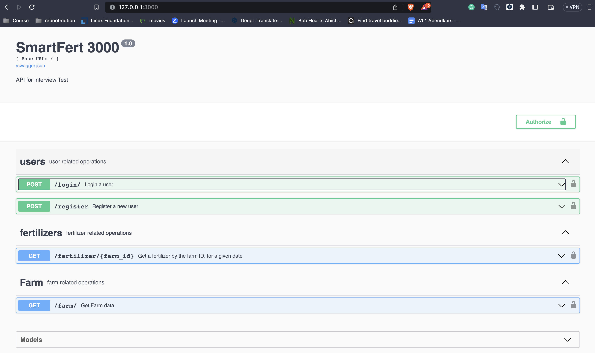

# Smart Fert API

## Overview

Smart fert API gives farmers an instant overview of the day-to-day fertilizer usage within their farm.

## Installation

You'll need to complete a few installation steps to run the API.

### Set up Python

The Smartfert API is a Python application, so you'll need a working Python environment to run it.

### Python Version

The API currently requires Python >= 3.9.

### Create a Virtual Environment
It's recommended to create and activate a virtual environment before installing dependencies. 

Python offers a built-in method for installing lightweight virtual environments, the `venv` module. To create a virtual environment with this command:

```shell
$ python3 -m <path to virtual environment>
```

After you've created your new virtual environment, you'll need to activate it in order to ensure subsequent commands use it instead of your system's default Python environment.

```shell
$ source .venv/bin/activate
```
### Install Dependencies
After you've created your virtual environment, you'll want to ensure that the correct dependencies are installed.

Run the pip command below to instead dependencies

```shell
 $  pip install -r requirements.txt
```
### Initialize Pre-Commit Hooks in the Repository

To configure git to use the API's configured pre-commit hooks (defined in [.pre-commit-config.yaml](.pre-commit-config.yaml)).

### Install the Pre-Commit Hook Package with Pip

```shell
$ python3 -m pip install pre-commit

$ pre-commit install
```

### Set up Docker

While you can easily perform some tasks (like testing) in a local virtual environment, it is recommended to set up Docker. You can [find instructions to install Docker here](https://docs.docker.com/engine/install/).

### Set up Docker Compose

Docker Compose is a tool for orchestrating Docker containers. If you have installed Docker Desktop, you already have Docker Compose installed. However, if you need to separately install Docker Compose, you can [find instructions for installing it here](https://docs.docker.com/compose/install/).

##### Build the database and API containers

If you've never built the API container before (and therefore don't have any build caches in place).

```shell
$ docker-compose build
$ docker-compose up
```

## Running Tests using docker

To run the tests using docker, run the command below

```shell
$ docker-compose up tests
```

## Start API manually


1. **Install Required Packages**

Install dependencies using the command given above

2. **Create A Database**

In order to perform migrations and run the app, you'll need to create a database. 
you should create a database called `smartfert`
To do this, you can use the [Postico](https://eggerapps.at/postico/) app or any other Postgresql client of your choice.

3. **Copy `.env` & set correct values**

The easiest way to set all environment variables needed for the API is to copy from sample:

$ cp .env_sample .env

The most important thing is to set the database credentials.


4. **Run Database Migrations**

To run the database migrations run the following commands:
```shell
$ python manage.py db init

$ python manage.py db migrate --message 'initial database migration'

$ python manage.py db upgrade
```

If the migration file exist; just run:
```shell
python manage.py db upgrade
```
**Note:**

if you encounter any issue while running the migration command, this might be because of the PostGIS extension. I used the `geometry` type to store the locations.

Here are the steps to install and enable the PostGIS extension:

Install PostGIS: Follow the installation instructions for your operating system to install the PostGIS extension. You can find the installation guides on the official [PostGIS website](https://postgis.net/install/):

Enable PostGIS in your database: Connect to your PostgreSQL database using a tool such as psql or a graphical interface. Then, run the following command to enable the PostGIS extension:

```shell
$ CREATE EXTENSION IF NOT EXISTS postgis;

```


5. **Run Application**

To run the application, run the following:

```shell

$ python manage.py run
```

6. **Seeding the database**

Run the command below to seed the database:
```shell

$ python manage.py seed
```

### Running tests

You can test by running the command.

```shell
$ pytest
```

## API Documentation

Once the application is running, you can view the API documentation by opening [api documentation](http://127.0.0.1:3000/) in the web browser of your choice.

To use the API, you can use the sample user credentials from the seed_database.py file to log in and obtain a bearer token for accessing other endpoints. Alternatively, you can use the register endpoint to create a new user.



